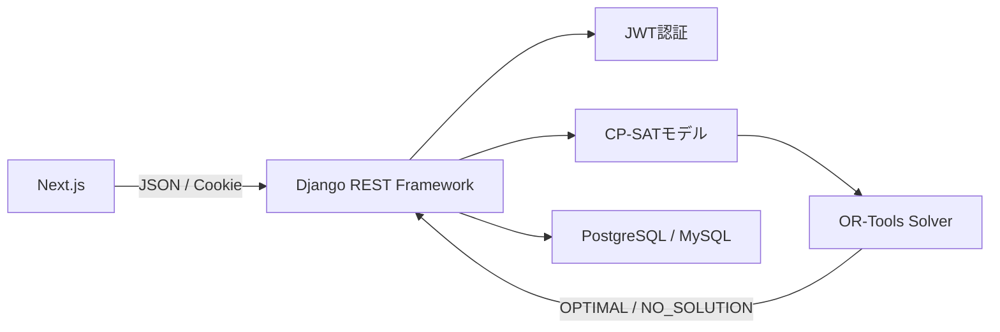

# シフト自動割当API

[シフト自動割当アプリ](https://github.com/matsugeEX/shift) のバックエンドAPIです。Django REST Frameworkで認証とAPIを提供し、Google OR-Tools CP-SATで従業員ごとの担当業務を自動割当します。

## 関連リンク

- フロントエンド: https://github.com/matsugeEX/shift
- デモ: https://shift-phi-beryl.vercel.app/

## 主な機能

- JWTを用いたログイン・トークン更新・ログアウト
- HttpOnly Cookieによるトークン送受信
- 認証済みユーザーのみ利用できるシフト生成API
- 従業員の勤務条件を基にした担当業務の自動割当
- 条件を満たす解がない場合の `NO_SOLUTION` 応答
- 本番環境のPostgreSQL、開発環境のMySQL設定

## システム構成



## 技術スタック

| 分類 | 技術 |
| --- | --- |
| 言語 | Python |
| Webフレームワーク | Django 6 |
| API | Django REST Framework |
| 最適化 | Google OR-Tools CP-SAT |
| 認証 | djangorestframework-simplejwt |
| CORS | django-cors-headers |
| データベース | PostgreSQL（本番）、MySQL（開発設定） |
| アプリケーションサーバー | Gunicorn |
| ホスティング | Render |

## 割当モデル

### 時間と担当

- 対象時間: 10:00〜21:00
- 時間単位: 15分
- 担当: `leader`、`register`、`break`、`other`

各従業員・時間帯・担当の組合せについて、次のブール変数を作成します。

```text
x[worker, slot, task] = その組合せを割り当てる場合は1、それ以外は0
```

勤務時間内では各スロットに必ず1つの担当を割り当て、勤務時間外の変数は0に固定します。

### 実装している制約

| 制約 | 現在の実装 |
| --- | --- |
| リーダー資格 | `leader: true` の従業員だけを対象とする |
| リーダー必要人数 | 11:00〜21:00に1名 |
| レジ必要人数 | 11:00〜11:30に2名、11:30〜17:00に3名、17:00〜19:30に2名 |
| レジ担当 | 1回につき60〜90分連続 |
| レジ終了後 | 60分間はレジへの再配置を禁止 |
| 休憩時間 | 勤務時間に応じて0、15、30、45、60、75分 |
| 休憩位置 | 勤務開始・終了の前後2時間を避け、18:30以降は禁止 |
| リーダー担当 | 1回につき60〜180分連続 |
| 最適化目標 | リーダー資格者間の担当時間の最大差を最小化 |

休憩時間は勤務時間から次のように決定します。

| 勤務時間 | 休憩 |
| --- | ---: |
| 4時間未満 | 0分 |
| 4時間以上5時間未満 | 15分 |
| 5時間以上6時間30分未満 | 30分 |
| 6時間30分以上8時間45分未満 | 45分 |
| 8時間45分以上11時間未満 | 60分 |
| 11時間以上 | 75分 |

### 補助変数

`register_start`、`register_end`、`break_start`、`leader_start` を使い、担当の開始・終了と連続区間を表現しています。

例えばレジ開始は、現在のスロットがレジかつ直前のスロットがレジでない場合に1となるよう、次の関係を設定します。

```text
register_start[current] >= is_register[current] - is_register[previous]
register_start[current] <= is_register[current]
register_start[current] <= 1 - is_register[previous]
```

この変数を基準に連続60分以上を要求し、7個の連続スロットの合計を6以下にすることで90分を上限としています。

## API

ベースパスは `/api/people/` です。

| Method | Path | 認証 | 概要 |
| --- | --- | --- | --- |
| POST | `/login/` | 不要 | ログインし、JWTをCookieへ設定 |
| POST | `/retry/` | Refresh Cookie | アクセストークンを更新 |
| POST | `/logout/` | 不要 | 認証Cookieを削除 |
| GET | `/person/` | 必要 | 登録済み人物の一覧を取得 |
| POST | `/person/` | 必要 | 人物を登録 |
| POST | `/allocation/` | 必要 | シフトを生成 |

### シフト生成

#### Request

```http
POST /api/people/allocation/
Content-Type: application/json
Cookie: access=<JWT>
```

```json
{
  "workers": [
    {
      "name": "田中",
      "start": "10:00",
      "end": "21:00",
      "leader": true
    },
    {
      "name": "佐藤",
      "start": "11:00",
      "end": "20:00",
      "leader": false
    }
  ]
}
```

#### Success response

```json
{
  "status": "OPTIMAL",
  "result": [
    {
      "name": "田中",
      "schedule": [
        { "time": "10:00", "task": "other" },
        { "time": "10:15", "task": "other" }
      ]
    }
  ]
}
```

#### No-solution response

```json
{
  "status": "NO_SOLUTION"
}
```

## ディレクトリ構成

```text
shift_backend/
├── api/
│   ├── people/
│   │   ├── allocation.py     # CP-SATによる割当モデル
│   │   ├── authentication.py # CookieからJWTを取得する認証クラス
│   │   ├── models.py         # Peopleモデル
│   │   ├── serializers.py    # Peopleシリアライザー
│   │   ├── urls.py           # APIルーティング
│   │   └── views.py          # 認証・人物・割当API
│   ├── hello/
│   └── hello_db/
├── config/
│   ├── settings/
│   │   ├── base.py
│   │   ├── development.py
│   │   └── production.py
│   ├── urls.py
│   ├── asgi.py
│   └── wsgi.py
├── manage.py
└── requirements.txt
```

## ローカルでの起動

### 前提

- Python
- MySQL（`development`設定を使用する場合）

### セットアップ

```bash
git clone https://github.com/matsugeEX/shift_backend.git
cd shift_backend
python -m venv .venv
```

仮想環境を有効化します。

```bash
# macOS / Linux
source .venv/bin/activate

# Windows PowerShell
.venv\Scripts\Activate.ps1
```

依存関係をインストールします。

```bash
pip install -r requirements.txt
```

`.env` を作成し、必要な環境変数を設定します。

```env
SECRET_KEY=replace-with-a-random-secret
DEBUG=True
DB_NAME=shift
DB_USER=shift_user
DB_PASSWORD=replace-with-your-password
DB_HOST=127.0.0.1
DB_PORT=3306
```

マイグレーションを実行し、開発サーバーを起動します。

```bash
python manage.py migrate --settings=config.settings.development
python manage.py runserver --settings=config.settings.development
```

APIは http://localhost:8000 で起動します。

## 本番環境

本番設定ではPostgreSQLを使用します。主な環境変数は次のとおりです。

```env
SECRET_KEY=replace-with-a-random-secret
ALLOWED_HOSTS=your-backend.example.com
FRONTEND_URL=https://your-frontend.example.com
DB_NAME=database_name
DB_USER=database_user
DB_PASSWORD=database_password
DB_HOST=database_host
DB_PORT=5432
```

起動例:

```bash
gunicorn config.wsgi:application
```

## 工夫した点

### 貪欲法ではなくCP-SATを選択

割当を時間順に確定すると、勤務開始直後に休憩が配置されたり、後の時間帯で必要人数が不足したりする場合がありました。また、レジの連続時間・再配置禁止、リーダー資格、休憩位置は相互に影響します。

そこで割当をブール変数として表現し、全時間帯の条件を同じモデル上で評価できるCP-SATを採用しました。

### リーダー担当時間の偏りを抑制

制約を満たすだけでなく、リーダー資格者ごとの担当時間を集計し、最大値と最小値の差を目的関数として最小化しています。

### フロントエンドと異なるオリジンでのCookie認証

本番ではフロントエンドとバックエンドを別オリジンに配置するため、CORSで許可するオリジンを限定し、資格情報付きリクエストを許可しています。JWT Cookieには `HttpOnly`、`Secure`、`SameSite=None` を設定しています。

## 現在の課題と今後の改善

- API入力の型・時刻範囲・重複名のバリデーション
- 求解不能の理由を返す診断情報
- 制約値をコードから設定データへ分離
- 割当結果の保存・履歴管理
- 単体テストとAPIテストの追加
- ログアウト時のCookie属性を発行時と揃える
- CSRF対策を含むCookie認証設計の再確認